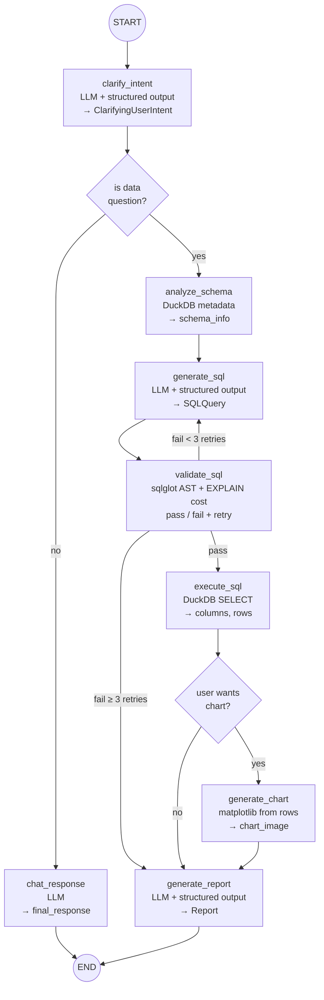

# sql-agent

A Streamlit + FastAPI application. The frontend provides a chat-style text interface; the backend serves API endpoints.

## Quick start

The provided `compose.yml` file takes care of mounting the appropriate volumes so the data is available to the system. Otherwise, you need to take care of creating the database and making it available for DuckDB on some path and then setting that path to `DB_PATH`.
```bash
docker compose up -d --build  # on the repo root
```

## The tool
Takes user queries in natural language, understands them and converts them into SQL that is reviewed and produces an answer. The query produced query is reviewed to determine malicious or unintentedly degrading queries


## Agent architecture

The agent is built as a [LangGraph](https://langchain-ai.github.io/langgraph/)
`StateGraph` — a deterministic pipeline of typed nodes that share a
[Pydantic](https://docs.pydantic.dev/) state schema.  Every LLM call uses
structured output, and inter-node data flows through typed fields rather
than raw-text tool arguments.

### Flow

1. **clarify_intent** — The user's raw prompt is classified by an LLM into a
   `ClarifyingUserIntent` (question, comparison, explanation, etc.).
2. **Route** — Data questions (`question`, `compare`, `list`, `generate`)
   enter the SQL pipeline; everything else is handled as a plain chat
   response.
3. **analyze_schema** — DuckDB is queried for table and column metadata.
4. **generate_sql** — An LLM writes a SELECT-only SQL query, grounded in
   the real schema.
5. **validate_sql** — A security gate that inspects the generated SQL
   before execution:
   - *Static analysis* (sqlglot AST): rejects destructive DML/DDL, system
     catalog access (`information_schema`, `duckdb_*()`), PRAGMA, SHOW,
     DESCRIBE, multi-statement queries, and other jailbreak patterns.
     CTE aliases are distinguished from actual statements — a CTE named
     `deleted_items` passes; `DELETE FROM …` does not.
   - *Cost analysis* (DuckDB EXPLAIN): rejects cross joins, full-table
     scans without filters, and queries exceeding cardinality thresholds
     (10 K rows without LIMIT/aggregation, 1 M rows absolute).
   - On rejection, routes back to **generate_sql** with the error for a
     retry (up to 3 attempts). On the third failure, routes to
     **generate_report** with an error.
6. **execute_sql** — The query runs read-only against DuckDB. Columns and
   rows land in state.
7. **generate_chart** (optional) — If the user explicitly requested a chart
   (`chart`, `plot`, `graph`, `bar`, `line`, `pie`), matplotlib renders it
   from the rows already in state — no SQL re-execution.
8. **generate_report** — A final LLM call produces a structured `Report`
   with an executive summary, key findings, recommendations, and a full
   markdown narrative for leadership.



## Version bumping

This project uses [bump-my-version](https://github.com/callowayproject/bump-my-version).

```bash
uv run bump-my-version bump patch   # 0.1.0 → 0.1.1
uv run bump-my-version bump minor   # 0.1.0 → 0.2.0
uv run bump-my-version bump major   # 0.1.0 → 1.0.0
```

Each bump updates `pyproject.toml`, commits the change, and creates a git tag.
